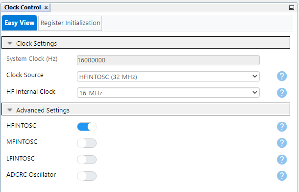
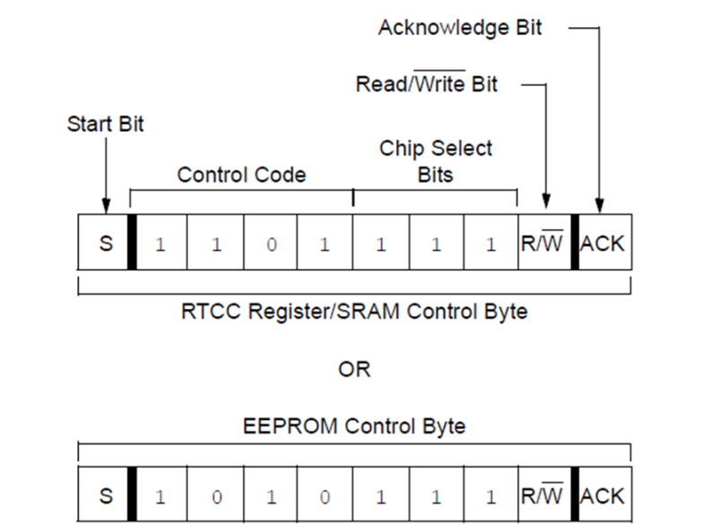

<!-- Please do not change this logo with link -->

# Interfacing RTCC Module to PIC16F15276 Microcontroller

This code example demonstrates the usage of PIC16F15276 microcontroller together with MCP79410 Real-Time Clock/Calendar (RTCC) module for alarm feature implementation in the embedded applications, where the PIC16F15276 microcontroller communicates with MCP79410 module through serial communication interface like I2C.

## Introduction

The PIC16F15244 microcontroller family microcontroller family is available in the general purpose device packages for various embedded applications. The PIC16F15276 simplified feature set includes Peripheral Pin Select (PPS), digital communication peripherals, timers, Enhanced Universal Synchronous Asynchronous Receiver Transmitter (EUSART). In real time applications, EUSART, can be configured as a full-duplex asynchronous system or half-duplex synchronous system. Full-Duplex mode is useful for communications with peripheral systems, such as CRT terminals and personal computers. Half-Duplex Synchronous mode is intended for communications with peripheral devices, such as A/D or D/A integrated circuits, serial EEPROMs or other microcontrollers. Several embedded applications use I/O expander to add the additional I/O pins required for the main microcontroller while interfacing standalone IC modules, display modules, for various features implementation. The Master Synchronous Serial Port (MSSP) module is a serial interface useful for communicating with other peripheral or microcontroller devices. These peripheral devices may be serial EEPROMs, shift registers, display drivers, A/D converters, etc. The MSSP module can operate in one of two modes:
- Serial Peripheral Interface (SPI)
- Inter-Integrated Circuit (I2C)

The Inter-Integrated Circuit (I2C) bus is a multi-host serial data communication bus. Devices communicate in a host/client environment where the host devices initiate the communication. A client device is controlled through addressing. The I2C bus specifies two signal connections:
- Serial Clock (SCL)
- Serial Data (SDA)

Both the SCL and SDA connections are bidirectional open-drain lines, each requiring pull-up resistors for the supply voltage. Pulling the line to ground is considered a logical zero and letting the line float is considered a logical one. This code example demonstrates the implementation of Real-Time Clock with alarm feature using MSSP, EUSART and I2C peripherals of the PIC16F15276 microcontroller.

## Related Documentation

- [Configuring the MCP794XX RTCC Family](http://ww1.microchip.com/downloads/en/Appnotes/01491A.pdf "Configuring the MCP794XX RTCC Family")
- [A Complete Electronic Watch Based on MCP79410 I2C RTCC](http://ww1.microchip.com/downloads/en/Appnotes/00001355B.pdf "A Complete Electronic Watch Based on MCP79410 I2C RTCC")
- [Using the Alarm Feature on the MCP79410 RTCC to Implement a Delayed Alarm](http://ww1.microchip.com/downloads/en/Appnotes/01364A.pdf "Using the Alarm Feature on the MCP79410 RTCC to Implement a Delayed Alarm")
- [PIC16F15276 Product Page](https://www.microchip.com/en-us/product/PIC16F15276 "PIC16F15276 Product Page")
- [PIC16F152xx Family Product Brief](https://ww1.microchip.com/downloads/en/DeviceDoc/40002140A.pdf "PIC16F152xx Family Product Brief")
- [PIC16F15244 Code Examples on GitHub](https://github.com/microchip-pic-avr-examples "PIC16F15244 Code Examples on GitHub")

## Description

In this code example, user input the timestamp data, which they prefer to set for the real-time clock, through UART serial communication interface. In addition to this, the user can also provide the timestamp for the alarm. The RTCC module provides user the feature to set two alarms. The PIC16F15276 microcontroller, communicates the timestamp received from the user to RTCC module through the I2C interface.

For the ease of demonstration, this code example uses PIC16F15276 Curiosity nano development board and  RTC 6 click from MikroElektronika for the Real-Time Clock with alarm feature implementation. There are multiple applications that necessitate time measurement, are requiring a RTCC module. RTC 6 click is based on Microchip's MCP79410, which offers a feature-rich RTCC that incorporates EEPROM, SRAM, unique ID, and timestamp. The RTC 6 click board is powered up but an on-board coin cell.

The microcontroller receives the user command and verifies the length of the input and sets the respective values for the real time clock using I2C interface.

  
   Figure 1: Block Diagram  

# Real-Time Clock

RTC 6 click carries Microchip’s MCP79410 Real-Time Clock/Calendar IC with built-in 64 bytes of battery-backed SRAM an additional 1 Kbit of EEPROM. 64 bits of protected EEPROM requires an unlock sequence to be unlocked, which makes it suitable for storing a unique ID or other critical information. RTC 6 click tracks hours, minutes, seconds, days, months, years, and weekdays, with leap year compensation until the year 2399. The clock frequency is derived from an onboard 32.768KHz crystal oscillator. Backup power is supplied by a coin-cell Lithium battery. RTC 6 click communicates with the target board microcontroller through the mikroBUS I2C interface (SCL, SDA) along with a multifunction pin (MFP, in place of default mikroBUS INT pin). The multifunctional pin (MFP) can be configured as an alarm, a square wave frequency output, or a general purpose output. The board is designed to use 3.3V.

The RTC 6 Click from MikroElektronika is used for the maintaining the timestamp as well as the alarm time.

  
   Fig 2: RTC 6 Click 

Terminal window shows the timestamp values set or read from RTC 6 Click in decimal and epoch clock format.

## Software Used

Microchip’s free IDE, compiler and graphical code generators are used throughout the application firmware development. Following are the tools used for this demo application:

* MPLAB X IDE [v6.00.0](https://www.microchip.com/mplab/mplab-x-ide "MPLAB X IDE v5.45")
* XC8 Compiler [v2.36.0](https://www.microchip.com/mplab/compilers "XC8 Compiler v2.30")
* MPLAB Code Configurator (MCC) [v5.0.3](https://www.microchip.com/mplab/mplab-code-configurator)
* UART MCC Melody driver 1.6.0
* MCC Melody Core 2.1.9
* I2C Host MCC Melody driver 1.0.2
* Microchip PIC16F1xxxx Series Device Support [1.9.163 or newer](https://packs.download.microchip.com/)

**Note: For running the demo, the installed tool versions should be same or later. This example is not tested with previous versions.**

## Hardware Used

* [PIC16F15244 Curiosity Nano](https://www.microchip.com/en-us/product/PIC16F15244)
* [Curiosity Nano Base for Click boards](https://www.microchip.com/developmenttools/ProductDetails/AC164162)
* [RTC 6 Click Board](https://www.mikroe.com/rtc6-click)

## Application Firmware

This example is comprised of a single firmware.

The firmware uses EUSART peripheral for communication with user for receiving the timestamp. Upon detection of a valid timestamp, the microcontroller sends the timestamp command to the RTC sensor over I2C interface. Also, it allows the user to set an alarm time. If the alarm timestamp is provided, then the respective command is provided to the sensor over I2C. On matching the alarm timestamp the on-board LED turns on.

## Appendix

MCC – MPLAB® Code Configurator is a graphical programming environment that generates seamless, easy to understand C code to give a head start to the project, saving the designer’s time to initialize and configure all the modules, and to go through the datasheets. Using an instructive interface, it enables and configures all peripherals and functions specific to the application requirements.

**Start by creating a new Project and open MCC**
* Go to File > New Project
* Select Microchip Embedded > Standalone Project
* Enter the device name. In this case, select PIC16F15276 device.
* Name the project
* Launch MCC tool by navigating to “Tools Embedded  MPLAB Code Configurator v4: Open/Close”. Alternatively, click the MCC icon to launch the MCC tool.

## System configuration

Open "Clock Control" setup present under "System" dropdown menu in "Project Resources" tab. Host and the client device will be configured with same configuration as given below.

- Set "Clock Source" as "HFINTOSC"
- Set "HF Internal Clock" as "16_MHz"
- Enable low power programming checkbox

The system configuration window of MCC is used for microcontroller oscillator, Watchdog timer and low voltage programming configuration. The Watchdog timer is disabled in the application.

The following figure shows the system configuration setting in MCC tool.

  
   Fig 3: Clock Configuration 

## MSSP Configuration

- Serial Protocol: I2C
- Mode: Host
- I2C Clock Frequency: 100kHz
- Slew Rate Control: Standard Speed
- SDA Hold Time: 100ns
- Interrupt Driven: Enabled

The curiosity Nano base for click boards mikroBUS slot 1 is used for RTC 6 click, I/O pins for the same are configured through pin manager section of MCC.

  
   Fig 4: MSSP Configuration 

## EUSART Configuration

The EUSART peripheral is used by both host and client devices for the communication amongst them. 

- Set EUSART Mode to Asynchronous
- Enable EUSART, Transmit & Receive checkbox
- Set Baud Rate to 9600
- Set Transmission and Reception bits to 8bit
- Select checkbox for Redirect STDIO to USART

  
   Fig 5: EUSART Configuration 

## Data Visualizer Configuration
 
Pre-configured data streamer file is available with the firmware package. The below steps given for data visualizer configuration use these files to prepare the setup.

* Configure the serial port for communication with the Curiosity Nano Adapter Board.
* Set the baud rate to 115200, parity to none and stop bits to 1.
* Ensure the DTR option and Open Terminal options both are checked and RTS is unchecked.
* Configure Terminal for visualizing the data values in real-time.

**NOTE**: Refer [Data Visualizer](http://www.microchip.com/DS40001903) user guide for more information.

## Pin Mapping

  
   Fig 6: Pin Configuration 

MFP is an output pin used for the alarm and square wave output functions. It can also serve as a general purpose output pin by controlling the OUT bit in the CONTROL register of the RTC 6 click. This pin may be left floating if not used.

## Hardware setup

The following figure consists of RTC 6 click, Curiosity Nano base for click boards and PIC16F15276 Curiosity Nano Evaluation Kit. The figure shows the detailed information about the hardware setup. The RTC 6 Click is interfaced with PIC16F15276 microcontroller using curiosity nano adapter slot 1.

  
   Fig 7: Hardware Setup 

Real-Time Clock demonstration needs input in epochs format. Also, the output data is in epoch format on the terminal. The required hardware connections are shown in the preceding figure.

In case of device addressing, the control byte is the first byte received following the Start condition from the host device. The control byte begins with a control code **'1101'** for SRAM/RTCC register read/write. The last bit of the control byte defines the operation to be performed, with **1** for read and **0** for write operation. The combination of the 4-bit control code and the three chip select(CS) bits will define the slave address as shown in the below figure.

  
   Fig 8: Control Byte Register 

## Operation

- Assemble the hardware as shown in the Hardware Setup. Power up the Curiosity Nano device using micro-USB cable.
- Download the firmware available from the GitHub page link.
- Build the project using latest version of tools as mentioned in the Software Tools section and load the generated hexadecimal file in to the PIC16F15276 microcontroller.
- After running the program, the initial display will ask for the functionality which user prefers to perform. Hence, the text/data that is displayed on the terminal is as shown in figure below.
- If the read the current stamp functionality is selected, RTC 6 click will provide the time previously stored in the battery backed SRAM.
- The functionality to set the time stamp, will allow the user to set the time of his choice. 
- The RTC 6 click is designed to operate using a 32.768kHz crystal oscillator, which starts the clock counters and does provide the accurate time if read after setting the time previously.
- For setting the alarm, the input array of characters must include epoch timestamp for the alarm to set.

## Conclusion

The Real-Time Clock with alarm feature can be executed with range of controller families that have less memory and do not support internal RTC feature. The RTC 6 Click supports a two alarm feature with inbuilt Microchip's MCP47910 device, which enables user to set timestamp along with 2 alarms. This code example demonstrates the usage of PIC16F15276 microcontroller together with Microchip’s MCP47910 RTCC module for the realization of real-time clock with alarm feature.